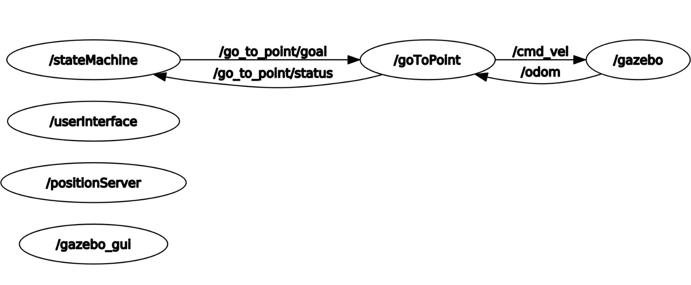

# Description of the branch 

In the branch it's possible to find:
* Launch folder containing the launcher for the simulation;
* Four nodes (two of them wrote in python and two in cpp):
    * go_to_point.py;
    * user_interface.py;
    * position_service.cpp;
    * state_machine.cpp;
* Three services used by the nodes:
    * Command.srv;
    * Position.srv;
    * RandomPosition.srv;
* An urdf folder containing the model of the robot;

### The nodes

A brief description of the nodes:

##### go_to_point.py
In this node we set the destination position, through the action `Moving`, that request the coordinates of the goal and implement the "preempted" concept, in which we can immediately stop the robot (in the case without the action we had to wait for the robot to reach the goal before shutting it down). We also manage all the velocities (through the topics /odom to check our position and /cmd_vel to set the velocities) to reach it. It is all managed throug a 3-state fsm.  

##### user_interface.py
In this node we just set, through a 0/1 value, our willingness to move the robot (0 to stop it and 1 to start it).

##### position_service.cpp
In this node we set the random coordinates we have to send, when requested, through the service RandomPosition.srv;

##### state_machine.cpp
This node manages, in a sense, the nodes before mentioned: we read if the user want to start the robot movement, request (in the case the user wants to move the robot) a random position and then send this position to the go_to_point node to reach the goal, through the action. In this case we monitor if the robot is moving (through a simple boolean variable) to decide if it's needed to set/cancel the goal, always thorugh the action.


## Running

To run the the simulation you have to write this command line:

```
roslaunch rt2_assignment1 sim.launch
```

Press <1> to start the robot. To stop the robot you have to press <0>.   


## Simulation

The robot is already on the point (0, 0) and will move to random positions as long as the user wants it to. 


## Architecture



When the simulation is running, the scheme of the architecture is this one in the picture. The gazebo node gives, through messagges on the topic /odom, information about the position and orientation of the robot, to the go_to_point node that publish the right velocities on /cmd_vel. Again, the ovrall application is managed through the stateMachine, as we can see (indeed it calla all the services needed and the action server).


## Future Implementation

It could be nice to set a custom goal and to stop the robot without cancelling the goal. For the first part, it should be enough to implement a section, in the state_machine node, where we ask the user which goal he wants to reach. Fo the second one I think it could be more tricky, because to stop the robot we have to cancel the goal: one solution could be to store the coordinates until the robot hasn't reached the goal.
