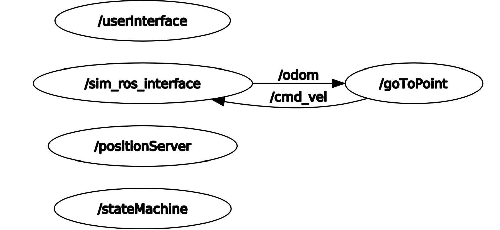

# Description of the branch 

In the branch it's possible to find:
* Launch folder containing the launcher for the simulation;
* Four nodes (two of them wrote in python and two in cpp):
    * go_to_point.py;
    * user_interface.py;
    * position_service.cpp;
    * state_machine.cpp;
* Three services used by the nodes:
    * Command.srv;
    * Position.srv;
    * RandomPosition.srv;
* An urdf folder containing the model of the robot;
* A Coppelia scene to test our nodes on a Coppelia simulation.

### The nodes

A brief description of the nodes:

##### go_to_point.py
In this node we set the destination position, through the service Position (that send us xy coordinates when called), and we manage all the velocities (through the topics /odom to check our position and /cmd_vel to set the velocities) to reach it. It is all managed throug a 3-state fsm.

##### user_interface.py
In this node we just set, through a 0/1 value, our willingness to move the robot (0 to stop it and 1 to start it).

##### position_service.cpp
In this node we set the random coordinates we have to send, when requested, through the service RandomPosition.srv;

##### state_machine.cpp
This node manages, in a sense, the nodes before mentioned: we read if the user want to start the robot movement, request (in the case the user wants to move the robot) a random position and then send this position to the go_to_point node to reach the goal.


### VREP Simulation

This simulation doesn't run on Gazebo but on the Coppelia environment. In the repository we can find the file *rt2_scene.ttt* that contains an environment with a robot, which scripts are linked to the four nodes running on the rosmaster. This way, the robot will move accordingly to what we want.


## Running

To run the the simulation you have to follow few steps. First of all, in the terminal, you have to write this command line:

```
roslaunch rt2_assignment1 sim.launch
```

Then open another tab (in the terminal), go to the Coppelia folder and write this command line:
```
./coppeliaSim.sh
```
You have to search the correct scene and open it directly into Coppelia and press the button 'Play' at the top of the tab. After that, in the first tab of the terminal, press <1> to start the robot. To stop the robot you have to press <0>, but the robot will reach the goal befor shutting down.   

If you don't have Coppelia on your machine, download the CoppeliaSim_Edu_V4_2_0_Ubuntu20_04 version.


## Simulation

The robot is already on the point (0, 0) and will move to random positions as long as the user wants it to. 


## Architecture



When the simulation is running, the scheme of the architecture is this one in the picture. The sim_ros_interface of CoppeliaSim gives, through messagges on the topic /odom, information about the position and orientation of the robot, to the go_to_point node that publish the right velocities on /cmd_vel.  

## Future implementation

One of the problem I encountered was the precision in reaching the goal: if the linear/angular velocities were too high (even if not unreasonable) the robot was not enough precise and needed to go forth and back to settle, so I had to lower the values of them. One future implementation could be to slow down the robot in proximity of the goal to avoid being to slow in the first part of the movement and too fast in the latter part.